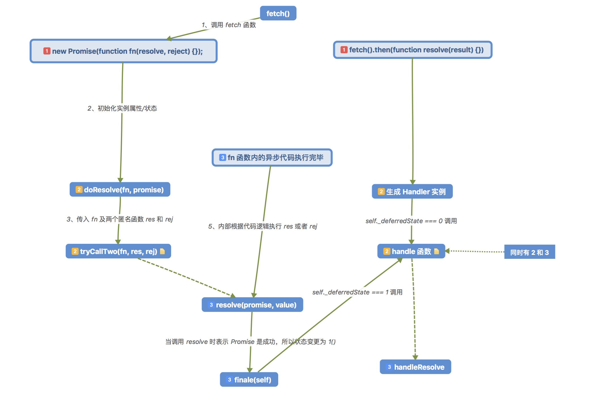

# Promise 源码阅读

本质上还是回调，不过可以链式调用很厉害。

## 原理大概

就像上面说的，本质上还是回调：

```javascript

function fetch() {
    return new Promise(function fn(resolve, reject) {
        setTimeout(() => {
            resolve('hello');
        }, 3000);
    });
}

fetch();
```

很明显，在调用`fetch`的时候，就会实例化一个`promise`对象，然后内部一系列处理，主要是调用了`fn`这个函数。既然调用了`fn`这个函数，那就会有一个异步操作（这里是`setTimeout`）在执行。

异步操作结束，调用`resolve`函数，而这个函数，会去拿自身实例的`then`方法的参数，上面的代码是没有调用`then`方法的，自然就没有，所以上面的代码会报错，没有处理成功或者失败。

```javascript
fetch()
    .then(res => {
        console.log(res);
    })
    .catch(err => {
        console.log(err);
    });
```

首先要明确的是，代码的执行是很快的，调用`fetch`函数并调用`then`方法可以说都是在一瞬间就完成了，只剩下异步代码在调用。所以上面的代码，会一直等待异步代码的执行完毕。


如果异步代码执行完成并`resolve`了，在`Promise`源码内部调用了`resolve`函数，并且拿到了`hello`这个值，最终调用`then`的参数，传入`hello`。

### 流程图



